# Instrument Registry for METLAB

A Django REST API backend with Vue.js frontend for managing laboratory equipment inventory.

## 📖 About This Project

A production instrument registry system developed for Tampere University's MET Laboratory. 
Tracks laboratory equipment, maintenance schedules, and history for ~3,000 instruments 
across hundreds of users.

**Project History:** Built by student teams across two semesters (Spring 2025 and Autumn 2025) with continued development and feature additions.

### ⭐ My Contributions (Tomi Manninen)

**Course:** Software Engineering Project 1 - Autumn 2025

**Project Role:** Junior Fullstack Developer

**Cross-Lingual Smart Search**


*User searches in **English**, and the system finds the **Finnish** instrument ("termostaatti") using vector embeddings.*

**Audit Trail & AI Automation**


*Tracks changes by users ("Tomi") and shows background **ML translation pipeline ("System")** automatically filling in translations.*

**AI Integration:**
- Built a FastAPI microservice responsible for:
    - Finnish→English machine translation for search queries (Helsinki-NLP/opus-mt)
    - English embedding generation for semantic search
- Integrated Google Gemini LLM for:
    - High-quality Finnish→English translation
    - Semantic description generation (enriched descriptions for better search)
- Fine-tuned Helsinki-NLP/opus-mt translation model for domain-specific laboratory terminology
- Integrated automated translation, data enrichment, and embedding generation into:
    - Background batch processing pipeline after a CSV import
    - Single-instrument creation
- Implemented a hybrid smart search (60-100ms end-to-end) combining:
    - Semantic similarity (PostgreSQL + pgvector)
    - Fuzzy text matching
- Built bulk translation correction to update all instruments sharing the same Finnish name

**Data Import & Performance:**
- Built a background job pipeline for translation/enrichment/embedding generation with:
    - Caching (translation, enrichment, and embedding caches)
    - Batch processing (parallel batch workers)
    - Majority voting to ensure translation consistency
- Optimized duplicate detection and CSV row insertion to handle large datasets efficiently
- Implemented a feature for selecting which potential duplicates to import when source data lacks unique identifiers

**Instrument History:**
- Implemented a full audit history for instruments:
    - Field-level diffs
    - Timestamps
    - User attribution
- Enables traceability of all changes to instruments over time

**Quality & UI/UX:**
- Authored automated test suites for the frontend, backend, and microservice
- Implemented GitHub Actions CI pipeline that runs tests across all services on every push
- Fixed various bugs across the stack
- Implemented UI/UX improvements

**Semantic Search Flow:**

```mermaid
flowchart LR
    subgraph Frontend
        UI[Vue.js]
    end

    subgraph Backend["Django API"]
        API[REST API]
        LANG{Language?}
    end

    subgraph ML["Semantic Service"]
        TRANS[Translate FI→EN]
        EMBED[Generate Embedding]
    end

    subgraph DB["PostgreSQL"]
        PG[(pgvector)]
    end

    UI -->|"Search query"| API
    API --> LANG
    LANG -->|Finnish| TRANS --> EMBED
    LANG -->|English| EMBED
    EMBED -->|"768-dim vector"| API
    API <-->|"Cosine similarity"| PG
    API -->|"Ranked results"| UI
```



*User searches in Finnish or English → Django detects language → Finnish queries get translated first → All queries become vector embeddings → PostgreSQL finds similar instruments using cosine distance → Results returned ranked by relevance.*

## 🚀 Quick Start

```
Assuming you have the repo already cloned, follow the instructions below:

# 1. Start the backend, database, and semantic search service
make up
# (first run installs Docker images, PyTorch deps, and ML models—expect a slow boot)

# 2. Import your data (optional), file needs to be in the Backend directory under root
# this also preprocesses instruments for embeddings and translations
make import-csv FILE=your-data.csv 

# 3.1 Install frontend dependencies (first time only) with
make frontend-install

# 3.2 Start frontend in dev mode
make frontend-dev

If it complains about Node.js version, run the following command in the Frontend folder:
nvm use

# 3. Access the system
Frontend: http://localhost:5173

In the future once data has been imported, you can simply run:
make fullstack
# Subsequent restarts are much faster because containers + models stay cached.
```

## 📋 Prerequisites

**Required:**
- **Docker Desktop** - https://www.docker.com/products/docker-desktop/
- **Git** - Usually pre-installed (Windows: https://git-scm.com/)
- **Make** - Pre-installed on Mac/Linux. Windows: `choco install make` or use Git Bash

**Optional (frontend development only):**
- **Node.js 18+** - https://nodejs.org/
- **Node Version Manager (nvm)** - https://github.com/nvm-sh/nvm or fnm

## 🛠️ Development Commands

### Backend (Django + PostgreSQL)
```bash
make up          # Start backend services
make semantic-search   # Start semantic search service only
make down        # Stop services
make logs        # View logs
make shell       # Django shell
make db-shell    # PostgreSQL shell
make test        # Run Django tests
make semantic-test # Run semantic search service tests
```

### Data Management
```bash
# Import commands compute translations and embeddings for instruments automatically
make import-csv-old FILE=data.csv    # Import Excel CSV
make import-csv FILE=data.csv        # Import normal CSV (already in correct format)
make export-csv                      # Export to CSV
make preprocess-instruments          # Compute translations and embeddings for instruments manually 
```

### Frontend (Vue.js)
```bash
make frontend-install    # Install dependencies (first time)
make frontend-dev        # Start dev server (http://localhost:5173)
make frontend-build      # Build for production
make frontend-test       # Run tests
```

### Full Stack
```bash
make fullstack          # Start both backend + frontend
```

### Semantic Search Service
```bash
make semantic-search          # (Re)start FastAPI translator/embedding service
make semantic-test            # Run tests for the semantic search service
docker compose logs -f semantic-search-service   # Follow logs
```
The semantic-search container powers Finnish→English translations and English embeddings. The Django backend also uses Google Gemini API for high-quality translation and semantic description generation (enrichment). Imports and preprocessing commands rely on both services.

## 🗂️ Project Structure

```
├── Backend/           # Django REST API
│   ├── instrument_registry/  # Main app
│   ├── requirements.txt
│   └── manage.py
├── Frontend/          # Vue.js SPA
│   ├── src/
│   ├── package.json
│   └── vite.config.js
├── semantic_search_service/ # FastAPI translator + embedding microservice
├── docker-compose.yml # Services configuration
└── Makefile          # Development commands
```

## 📊 Features

- **REST API** - Full CRUD operations for instruments
- **CSV Import/Export** - Handle Excel data easily
- **Search & Filter** - Find instruments by various criteria
- **User Authentication** - Token-based auth with Knox
- **Responsive UI** - Vue.js frontend with Bootstrap
- **Docker Ready** - Containerized development environment

## 🔧 Configuration

The system uses Docker environment variables (no manual setup needed):
- **Database:** PostgreSQL 17 on port 5432
- **Backend:** Django on port 8000
- **Frontend:** Vite dev server on port 5173
- **Google Gemini API:** Required for enrichment (translation + semantic descriptions). Set `GOOGLE_GENAI_API_KEY` in your environment (.env)

## 🚨 Troubleshooting

### Windows Users
If `make` commands don't work, use Docker Compose directly:
```bash
docker-compose up        # Instead of 'make up'
docker-compose down      # Instead of 'make down'
docker-compose logs -f   # Instead of 'make logs'
```

### Common Issues
- **Port conflicts:** Stop other services using ports 5432, 8000, 5173
- **Docker not running:** Start Docker Desktop
- **Permission errors:** Ensure Docker has proper permissions

## 📚 Additional Documentation

- **Backend details:** `Backend/README.md`
- **Frontend details:** `Frontend/README.md`
- **Original setup instructions:** `Backend/instructions/`

## 🎯 Architecture

- **Frontend:** Vue.js + Bootstrap
- **Backend:** Django REST Framework
- **ML Services:**
    - **Semantic Search Service:** FastAPI + Helsinki-NLP (translation) + SentenceTransformer (embeddings)
    - **Enrichment Service:** Google Gemini LLM (translation + semantic descriptions)
- **Database:** PostgreSQL 17 + pgvector extension
- **Infrastructure:** Docker Compose

---

**Need help?** Run `make help` to see all available commands.
